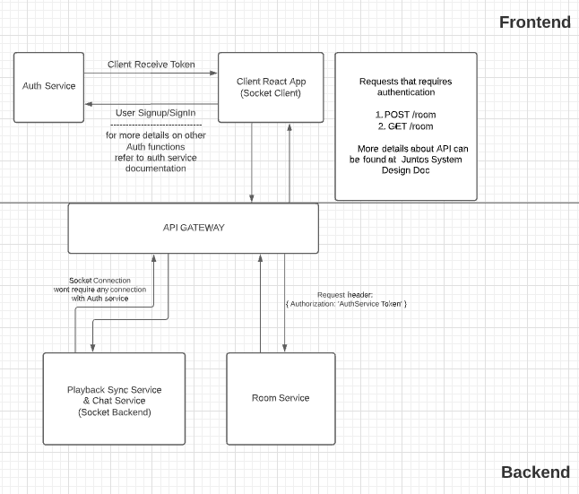

# Juntos Auth Service

Example Implementation [juntos-auth-service-example]()



This Authentication module will provide basic auth functionality as follows:-

1. `signIn`

   system validate the credentials and logs the user into the Application.

   `@params (email: string, password: string);`

   `@returns promise with user`

   ```js
   signIn({
     email: "test@gmail.com",
     password: "123456",
   })
     .then(function (user) {
       // Update successful.
     })
     .catch(function (error) {
       // An error happened.
     });
   ```

2. `signUp`

   Register user into the Application.

   `@params (Object: {email: string, password: string, name: string});`

   `@returns promise with user`

   ```js
   signUp({
     email: "test@gmail.com",
     password: "123456",
     name: "Raza",
   })
     .then(function (user) {
       // Update successful.
     })
     .catch(function (error) {
       // An error happened.
     });
   ```

3. `updateProfile`

   Existing users can modify their details which will be updated in user Data base.

   `@params (Object: {displayName: string, photoUrl: string});`

   `@returns promise with user`

   ```js
   updateProfile({
     displayName: "Jane Q. User",
     photoURL: "https://example.com/jane-q-user/profile.jpg",
   })
     .then(function () {
       // Update successful.
     })
     .catch(function (error) {
       // An error happened.
     });
   ```

4. `forgetPassword`

   To avoid multiple failed login attempt with wrong credentials can use forgot password option it will send out an reset link on registered Email.

   `@params (email: string);`

   `@returns promise with user`

   ```js
   forgetPassword(email: "test@test.com")
     .then(function () {
       'email sent successfully'
     })
     .catch(function (error) {
       // An error happened.
     });
   ```

5. `updatePassword`

   Existing users can modify their password which will be updated in user Data base.

   `@params (password: string);`

   `@returns promise with user`

   ```js
   updatePassword(password: "*******")
     .then(function () {
       'password updated successfully'
     })
     .catch(function (error) {
       // An error happened.
     });
   ```

6. `logout`

   Current login session will be end and user will be signed out of the Application.

   `@params();`

   `@returns promise`

   ```js
   logout()
     .then(function () {
       "logged out successfully";
     })
     .catch(function (error) {
       // An error happened.
     });
   ```

## Details About Firebase configuration that is being used in the project.

```js
// For Firebase JavaScript SDK v7.20.0 and later, `measurementId` is an optional field.
var firebaseConfig = {
  apiKey: API_KEY,
  authDomain: PROJECT_ID + ".firebaseapp.com",
  databaseURL: "https://" + PROJECT_ID + ".firebaseio.com",
  projectId: PROJECT_ID,
  storageBucket: PROJECT_ID + ".appspot.com",
  messagingSenderId: SENDER_ID,
  appId: APP_ID,
  measurementId: "G-MEASUREMENT_ID",
};
```

1. `apiKey`: An API key is a unique string that's used to route requests to your Firebase project when interacting with Firebase and Google services.
2. `messagingSenderId`: The sender ID identifies your app to Firebase Cloud Messaging when it asks for a token
3. `measurementId`: Its an optional field its required to use analytics So if not using analytics its not needed.
4. `projectId`: Unique ID generated for your firebase project.
5. `authDomain`: Domain name for your application.
6. `databaseURL`: Users use their Firebase database URL to access their stored information.
7. `appId`: Unique APP ID generated that is platform specific (e.g. WEB, ANDROID, IOS).
