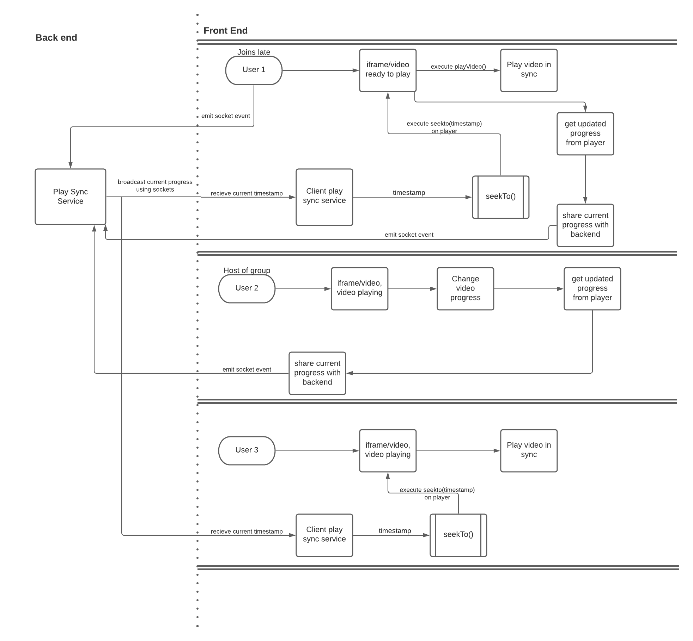

# Youtube API - seekTo()

## Overview
`seekTo()` function is available on the player object and is used to play the video from the timestamp specified - `seekTo(timestamp)`.

## Use Cases  
seekTo() function can be used in the following scenarios  
* When a user joins late 

    When the video starts playing the video sync service on the client side will keep track of current play progress. The progress will be shared to the backend by all clients and the backend video sync service will check if all users are on the same progress. When a user joins late, on joining, the client video sync service will get the current video progress(timestamp) from the backend video sync service. On recieveing the timestamp, `seekTo()` will be executed post which `playVideo()` will be executed.This will sync the late joining user to the current video progress of the group.  

* When user changes the progress of the video  

    When the host of the group decides to play video from a non-zero timestamp, i.e the user changes progress bar position. An event* is fired that communicates the current progress to the backend which further communicates this with all the other connected clients. Other connected clients on recieving this information will execute `seekTo()` followed by `playVideo()`.
    
### Flow Diagram

[Lucid chart link](https://lucid.app/lucidchart/invitations/accept/inv_2a7ff478-576c-4502-951f-c550e590a4c8?viewport_loc=-897%2C-173%2C3640%2C1785%2C0_0)

### Open Questions
* How to get current progress of the playing video?
    
    Possible Solutions:  
    * Use `setTimeout()` to recurrently call `player.getCurrentTime()` to check any cahnge in progress   
    * Implement a wrapper of HTML5 `<video>` around `<iframe>` and use `ontimeupdate` provided by HTML5 `<video>`  

    Stackoverflow References:  
    * [Reference 1](https://stackoverflow.com/questions/9914373/ontimeupdate-with-youtube-api/51552777)  
    * [Reference 2](https://stackoverflow.com/questions/54499081/how-to-register-event-to-youtube-video-play-progress) 