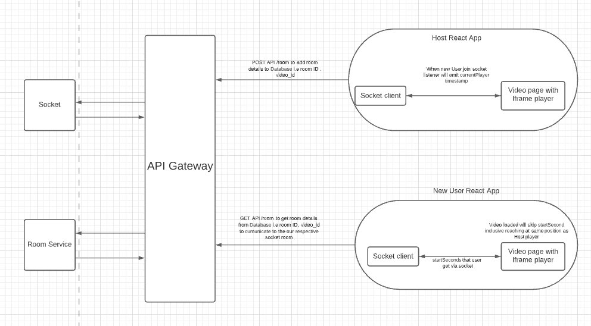

# YouTube Iframe API - startSecond

The property **startSeconds** lets you skip the given seconds from the start of video.

## Brief Overview

- **startSeconds** load video and skip the given seconds from the start.
- **startSeconds** only available when the player is loaded.
- **startSeconds** can be called at the initial load of the video.

## How it can help with Sync

We can use this configuration for people that join the group late after video has already started to make them sync to other Users.
So when User join the host Party we will assign host youtube player current timestamp by method player.getCurrentTime(); to the start seconds i.e startSeconds = hostPlayer.player.getCurrentTime():Number.

The above logic can be acheived via sockets where host client will broadcast getCurrentTime() that will be shared to all other clients except host client to maintain video sync.

```js
io.on("connection", (socket) => {
  // everyone gets it but the sender
  socket.broadcast.emit("video_current_times", {
    time: player.getCurrentTime(),
  });
});
```

now this broadcast will be captured by newly user that joins by the following code.

```js
socket.on("video_current_times", function (data) {
  // save this data
  if(!this.state.videoLoaded) {
    this.setState(currentTime: data.time);
  }
});
```

After youtube video is loaded to dom we will execute player method loadVideoById to use startSeconds
```js
function onPlayerReady(event) {
  console.log("player loaded to dom");
  player.loadVideoById({
    videoId: "bHQqvYy5KYo",
    startSeconds: this.state.currentTime,
  });
  // set videoloaded to avoid setting currentTime
  this.setState({ videoLoaded: true });
}
```
this would sync our new User that joins the room with the host currentTimestamp of video

## Reference/Examples:

Below flow chart explain how will sync work for user joining our app late.



Here an example of how the video is loaded by startSeconds via loadVideoById method.

```html
<!-- 1. The <iframe> (and video player) will replace this <div> tag. -->
<div id="player"></div>
<script>
  // 2. This code loads the IFrame Player API code asynchronously.
  var tag = document.createElement("script");
  tag.src = "https://www.youtube.com/iframe_api";
  var firstScriptTag = document.getElementsByTagName("script")[0];
  firstScriptTag.parentNode.insertBefore(tag, firstScriptTag);

  // 3. This function creates an <iframe> (and YouTube player)
  //    after the API code downloads.
  var player;
  function onYouTubeIframeAPIReady() {
    player = new YT.Player("player", {
      height: "390",
      width: "640",
      playerVars: { playsinline: 1 },
      events: { onReady: onPlayerReady },
    });
  }

  // 4. The API will call this function when the video player is ready.
  function onPlayerReady(event) {
    console.log("player loaded to dom");
    player.loadVideoById({
      videoId: "bHQqvYy5KYo",
      startSeconds: 30
    });
  }
</script>
```
